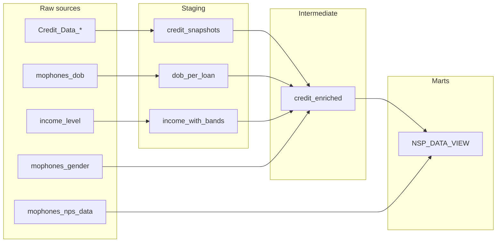

# Data lineage

## Overview

Data flows from **raw sources** → **staging** → **intermediate** → **marts** to support:

1. **Ongoing collections and credit analysis** (credit snapshots, DPD, balance, arrears, status).
2. **Consistent linkage between credit metrics and NPS** (same `loan_id`, same DPD buckets and status in the NPS mart).

---

## Lineage diagram (Mermaid)

---

## Dependency table

| Layer        | Model / source       | Depends on |
|-------------|----------------------|------------|
| Raw         | Credit_Data_* (5)    | —          |
| Raw         | mophones_dob         | —          |
| Raw         | income_level         | —          |
| Raw         | mophones_gender      | —          |
| Raw         | mophones_nps_data    | —          |
| Staging     | credit_snapshots     | Credit_Data_* |
| Staging     | dob_per_loan         | mophones_dob |
| Staging     | income_with_bands    | income_level |
| Intermediate| credit_enriched      | credit_snapshots, dob_per_loan, income_with_bands, mophones_gender |
| Marts       | NSP_DATA_VIEW        | credit_enriched, mophones_nps_data |

---

## Run order

1. **Staging**: `credit_snapshots`, `dob_per_loan`, `income_with_bands` (order between these three does not matter).
2. **Intermediate**: `credit_enriched`.
3. **Marts**: `NSP_DATA_VIEW`.

Generate full lineage with `dbt docs generate` and `dbt docs serve` when using dbt.
